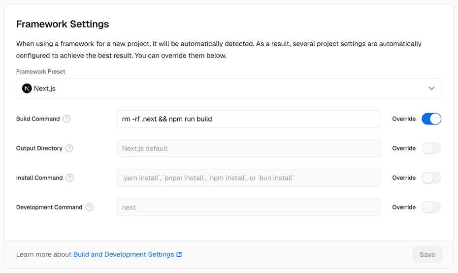

# Vercel Cache Issue: Missing Components After Deployment

## Problem

Components/pages work locally but disappear in production due to Vercel's build caching.

## Solution

Override the build command to force clean builds:

1. Go to Vercel project → **Settings** → **Framework Settings**
2. Click **Override** next to "Build Command" 
3. Enter: `rm -rf .next && npm run build`
4. Save and redeploy

## Result

✅ Consistent deployments  
✅ All components appear correctly  
✅ No more cache-related issues
